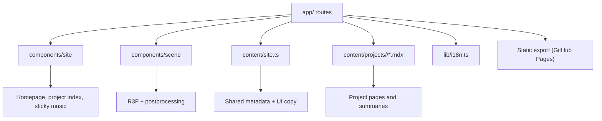

# Junxu Zhang Portfolio

A bilingual, static-exportable portfolio built with **Next.js App Router**, **React 19**, **TypeScript**, and **React Three Fiber**. The site combines a cinematic 3D hero, project pages driven by **MDX**, bilingual routing, SEO metadata, structured data, and a GitHub Pages deployment workflow.

## What This Portfolio Shows

- A visually rich homepage with a lightweight 3D scene.
- Dedicated project routes with per-project metadata.
- A bilingual content system for English and Chinese.
- A sticky mini music module preserved from the original site.
- GitHub Pages-friendly static export and asset optimization.

## Tech Stack

- **Next.js 16 / App Router**: route-based architecture, metadata, static export.
- **React 19 + TypeScript**: typed UI and shared content models.
- **Three.js + React Three Fiber**: the 3D scene is written as React components.
- **@react-three/drei**: helper primitives for camera, float, texture loading, and controls.
- **@react-three/postprocessing**: bloom, depth of field, noise, and vignette for the hero scene.
- **MDX content pipeline**: each project lives in its own document under `content/projects/<locale>/`.
- **Bilingual routing**: English routes live at `/`, Chinese routes live under `/zh/`.
- **SEO tooling**: metadata, Open Graph, Twitter cards, JSON-LD, `robots.txt`, and `sitemap.xml`.
- **Deployment**: static export plus GitHub Actions for GitHub Pages.
- **Asset optimization**: resized image variants under `public/optimized/images/` for faster loading.

## Architecture



## Content Workflow

Adding a new project is intentionally low-friction:

1. Copy an existing file in `content/projects/en/` and `content/projects/zh/`.
2. Update the frontmatter fields: `slug`, `title`, `summary`, `seoDescription`, `image`, `liveUrl`, `role`, `focus`, and `tech`.
3. Add the body copy below the frontmatter.
4. Rebuild. The new project automatically appears in the homepage, project index, sitemap, and both locale routes.

## Performance Notes

- The hero canvas uses reduced device-pixel ratio and lighter postprocessing.
- Project cards use lazy-loaded images.
- The homepage image set points at compressed variants in `public/optimized/images/`.
- Sections use `content-visibility` to reduce offscreen work.

## SEO Notes

- Each page exports metadata through the App Router.
- Project detail pages generate per-route canonical URLs.
- JSON-LD is used for the homepage and project pages.
- `robots.txt` and `sitemap.xml` are generated in the app router.

## Development

```bash
pnpm install
pnpm dev
pnpm build
```

## Deployment

The project is configured for GitHub Pages as a static export. The build output lands in `out/`, and the workflow under `.github/workflows/deploy.yml` publishes it.

## Notes

- The original media assets were preserved and reorganized into the new structure.
- The 3D and content layers are designed to stay maintainable as the portfolio grows.
- The site is bilingual by design, so new work can be added in both languages without changing the route architecture.
- The English resume download is regenerated from `Junxu_Zhang.docx` and stored at `public/pdf/english.PDF`.
